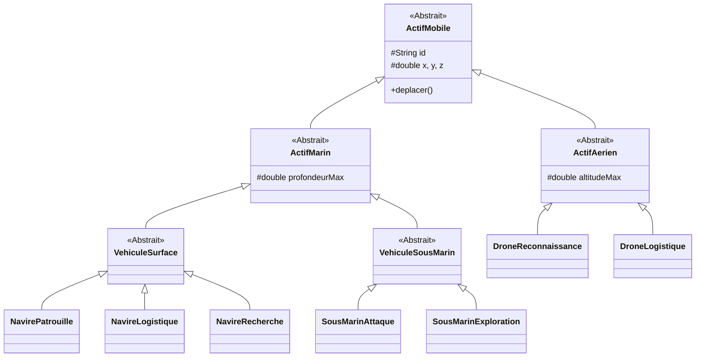

# Projet de Simulation SPIGA (JavaFX)

## 1. Vue d'Ensemble du Projet
**SPIGA** (Système de Pilotage Intelligent et Gestion d'Actifs) est une simulation orientée objet complexe construite en **Java 21** utilisant **JavaFX**.
Elle simule un environnement multi-domaines (Aérien, Surface, Sous-marin) où des drones et navires autonomes exécutent des missions, interagissent avec l'environnement (Météo, Obstacles) et sont gérés par une logique d'essaim centralisée.

Ce projet démontre des concepts avancés de **Programmation Orientée Objet (POO)** et de **développement d'interfaces graphiques (GUI)** en temps réel.

---

## 2. Architecture Technique : Modèle MVC

L'application suit strictement le modèle de conception **Modèle-Vue-Contrôleur (MVC)** pour garantir la séparation des responsabilités.

### 2.1 Modèle (Données & Logique)
Situé dans `com.spiga.core`, `com.spiga.management` et `com.spiga.environment`.
- **Responsabilités** : Définit les entités (Drones, Navires), leur physique, l'état de l'environnement et les règles métier (Missions).
- **Concepts Clés** : Héritage, Polymorphisme, Encapsulation.

### 2.2 Vue (Visualisation)
Situé dans `com.spiga.ui` et `src/main/resources`.
- **Responsabilités** : Affiche l'état potentiel du modèle à l'utilisateur.
- **Composants** :
    - Fichiers FXML : Définissent la mise en page.
    - `MapCanvas` : Affiche la vue de dessus (Top-Down X, Y).
    - `SideViewCanvas` : Affiche la vue de profil (Altitude/Profondeur).
- **Concepts Clés** : Dessin 2D (Canvas), Transformation de Coordonnées, Gestion d'Événements.

### 2.3 Contrôleur (Orchestration)
Situé dans `com.spiga.ui`.
- **Responsabilités** : Fait le lien entre la Vue et le Modèle. Gère les entrées utilisateur (clics, touches) et met à jour le Modèle.
- **Composants** : `MainController`, `MissionController`, `SidebarController`.
- **Concepts Clés** : Injection de Dépendances (`@FXML`), Listeners, Threading.

---

## 3. Analyse des Packages et Classes

### 📦 `com.spiga.core` (Le Modèle de Domaine)
Ce package contient les entités fondamentales de la simulation.

*   **`ActifMobile` (Classe Abstraite)** : La racine de la hiérarchie. Représente tout actif mobile. Gère les IDs uniques, la position (x, y, z) et les méthodes de mouvement abstraites.
*   **`ActifAerien` (Classe Abstraite)** : Hérite de `ActifMobile`. Ajoute la physique aérienne (Altitude max, consommation générique).
*   **`ActifMarin` (Classe Abstraite)** : Hérite de `ActifMobile`. Ajoute la physique marine (Profondeur, contraintes aquatiques).
*   **`Pilotable`, `Deplacable` (Interfaces)** : Définissent des contrats stricts pour le contrôle (démarrer/arrêter) et le calcul de mouvement, forçant le polymorphisme.
*   **Classes Concrètes** :
    *   `DroneReconnaissance` : Rapide, grande portée de surveillance.
    *   `DroneLogistique` : Transporte du fret, plus lent.
    *   `VehiculeSurface` (Abstrait) : Parent pour les navires de surface (Z=0 fixe).
    *   `NavirePatrouille`, `NavireLogistique`, `NavireRecherche` : Implémentations spécifiques de navires.
    *   `VehiculeSousMarin` : Parent pour les unités sous-marines.
    *   `SousMarinAttaque`, `SousMarinExploration` : Implémentations spécifiques de sous-marins.

### 📦 `com.spiga.management` (Logique Métier)
Gère le "Cerveau" de la simulation.

*   **`GestionnaireEssaim`** : Le gestionnaire de collection personnalisé. Détient la liste de toutes les unités actives (`List<ActifMobile>`). Fournit des méthodes pour ajouter, supprimer et interroger des unités.
*   **`SimulationService`** : Le moteur.
    *   Contient la **Boucle de Simulation** (Game Loop).
    *   Met à jour l'état de chaque unité 60 fois par seconde.
    *   Gère le temps (`SimulationTimer`).
*   **`Mission` (Hiérarchie)** :
    *   Classe de base abstraite pour l'assignation des tâches.
    *   Sous-classes : `MissionSurveillance`, `MissionLogistique`, `MissionRechercheEtSauvetage`.
*   **`Communication`** : Simule un bus de messages entre le QG et les unités. Utilise l'association pour répartir les missions aux actifs appropriés.

### 📦 `com.spiga.ui` (Interface Utilisateur)
*   **`MainController`** : Le point d'entrée pour la logique UI. Initialise la simulation et lie les Canvas au Service.
*   **`MissionController`** : Logique spécialisée pour la fenêtre de dialogue "Créer Mission". Valide les entrées (ex: empêche d'assigner un sous-marin à une cible en haute altitude).
*   **`SidebarController`** : Met à jour le panneau de détails. Utilise `Platform.runLater()` pour mettre à jour l'UI en toute sécurité depuis le thread de simulation.
*   **`MapCanvas` / `SideViewCanvas`** : Composants de dessin personnalisés qui surchargent `LayoutChildren` ou `draw()` pour rendre l'état de la simulation graphiquement.

### 📦 `com.spiga.environment` (Contexte Environnemental)
*   **`Weather`** : État global (Singleton) contenant la Vitesse du Vent, la Direction et la Pluie. Affecte les batteries des drones et le mouvement.
*   **`Obstacle`** : Objets statiques dans le monde. Les unités doivent les éviter (Détection de Collision).
*   **`RestrictedZone`** : Zones d'exclusion cylindriques définies par (X, Y, Rayon) et limites de Hauteur.

---

## 4. Diagramme de Hiérarchie des Classes (Mermaid)



---

## 5. Approfondissement Technique

### 5.1 La Boucle de Simulation
Le cœur de la simulation tourne sur un `AnimationTimer` (JavaFX).
*   **Cycle** :
    1.  `handle(long now)` est appelé (~60fps).
    2.  `SimulationService` met à jour le modèle :
        *   Itère sur tous les `ActifMobile`.
        *   Calcule les nouvelles positions basées sur la vitesse, la direction et **l'Impact Météo**.
        *   Vérifie les collisions (`Obstacle`, `RestrictedZone`).
        *   Met à jour les niveaux de batterie/carburant.
    3.  `MainController` demande un redessin de `MapCanvas` et `SideViewCanvas`.

### 5.2 Système de Coordonnées & Projection
*   **Coordonnées Monde** : Mètres réels (Virgule flottante).
    *   X, Y : Plan horizontal.
    *   Z : Altitude (+) / Profondeur (-).
*   **Coordonnées Écran** : Pixels (Entiers).
    *   **Vue Carte** : Mapping direct `EcranX = MondeX * Echelle`.
    *   **Vue Profil** : Projection orthogonale.
        *   Axe X = Distance depuis l'origine/caméra.
        *   Axe Y = Z Mappé (L'altitude est vers le HAUT, mais le Y écran est vers le BAS, donc une inversion est appliquée).

### 5.3 Modèle de Threading
*   **Thread UI (FX Application Thread)** : Gère le rendu et les événements utilisateur.
*   **Logique** : Tourne actuellement sur le même thread/timer pour la simplicité dans cette version, mais `Platform.runLater()` est strictement utilisé dans `SidebarController` pour garantir la sécurité des threads si la logique passait en arrière-plan.

---

## 6. Installation & Exécution

### Prérequis
*   **Java 21** SDK
*   **Maven** 3.8+

### Comment Lancer
1.  **Compiler** :
    ```bash
    ./mvnw clean compile
    ```
2.  **Exécuter** :
    ```bash
    ./mvnw javafx:run
    ```

### Comment Modifier
*   **Ajouter un nouveau Drone** : Créer une classe héritant de `ActifAerien` dans `com.spiga.core`.
*   **Ajouter une nouvelle Mission** : Hériter de `Mission` dans `com.spiga.management`.
*   **Changer l'interface** : Modifier `MainView.fxml` et mettre à jour `MainController`.
